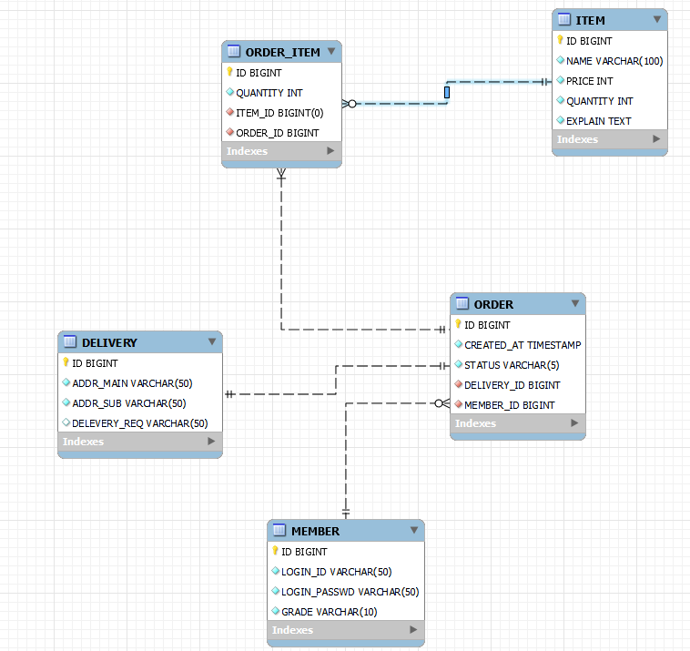

# 쇼핑몰 만들기

## 쇼핑몰 기능
- 로그인(일반, 관리자)
- 마이페이지(일반)
- 상품 등록, 수정, 삭제(일반)
- 장바구니(일반)
- 판매자와 구매자 간의 거래 후기(일반)
- 공지사항(관리자), 공지사항 댓글(일반)
- 회원 관리(관리자)

## 1. loginV1
- Member 로그인 기능
- Map으로 MemoryMemberRepository 구현
- 코드가 엉망진창

## 2. loginV2
- Service계층 도입. controller에서 하던 ID, Password 확인을 Service로 이동.
- Service에 loginId 중복 확인 코드 추가. 중복 시에, log.error로 로그 남김
- 로그인을 위한 POST 요청 후 redirect 코드 추가. 
- RedirectAttributes를 사용해서 redirect후에도 view 렌더링에 필요한 model 데이터가 유지되도록 함. (https://baeldung-cn.com/spring-web-flash-attributes 참고함)

## 3. loginV3
- 관리자로 로그인 시 다른 사용자의 정보를 표 형태로 출력.
- 회원가입할 때 LoginId가 겹치는 경우 예외를 발생시켜서 테스트에 용이한 코드 만들기
- MemberServiceImpl 테스트 코드 생성
- DbMemberRepository 거의 만듦

## 4. loginV4
- Test 코드에서 em이 주입되지 않는 문제 해결(@SpringBootTest 추가)

## 5. loginV5
- MemberJoinForm(회원가입), MemberLoginForm(로그인)추가해서 회원가입과 로그인을 Validation.
- 로그인할 때, select문이 두번 나가는 로직 수정.
- 회원가입 시에, 중복id를 가지는 회원이 있다면 global error로 알려주기.
- 로그인 시에, 없는 id이거나 비밀번호가 틀리면 global error로 알려주기.
- login-home.html과 login-admin.html 통합
- 로그인 하지 않은 사용자, USER, ADMIN이 같은 login-home.html을 "/"로 공유하도록 만듦

## 6. loginV6
- 세션으로 로그인, 로그아웃 기능 구현

## 7. loginV7
- 상품 등록, 주문, 배달에 필요한 Entity 추가.

  

### 7-1. 엔티티 필드 설명
모든 엔티티의 ID는 PK를 위한 의미없는 숫자.
- MEMBER
  - LOGIN_ID : 로그인을 할 때 사용하는 아이디
  - LOGIN_PASSWD : 로그인을 할 때 사용하는 비밀번호
  - GRADE : 사용자가 일반 사용자인지 관리자인지 구분하기 위해 사용
- ITEM
  - NAME : 상품 이름
  - PRICE : 상품 가격
  - QUANTITY : 상품 재고 갯수
  - EXPLAIN : 상품 상세 설명
- ORDER
  - CREATED_AT : 주문한 날짜, 시간
  - STATUS : 주문 진행 상태 ( 주문, 판매자 확인, 배송, 배송완료 ... )
- ORDER_ITEM ( ORDER - ITEM의 N:M관계를 풀어내기 위한 엔티티 )
  - QUANTITY : 해당 ITEM의 주문 수량
- DELIVERY
  - ADDR_MAIN : 도로명 혹은 지번
  - ADDR_SUB : 상세 주소
  - DELIVERY_REQ : 배송 요청사항
### 7-2. 엔티티 관계 설명
- MEMBER - ORDER
  - 회원은 여러건의 주문 가능(MEMBER -> ORDER : 1 -> N)
  - 주문을 하지 않은 회원도 있음(MEMBER의 부분참여)
  - 한건의 주문은 한명의 회원만 생성 가능(ORDER -> MEMBER : 1 -> 1)
  - 회원 없이 주문은 불가능(ORDER의 전체참여)
- ORDER - ITEM ( ORDER_ITEM은 N:M관계를 풀어내기 위한 엔티티이므로 설명 생략 ) 
  - 한번에 여러 상품을 주문할 수 있음 ( ORDER -> ITEM : 1 -> N )
  - 상품 없는 주문은 불가능 ( ORDER의 전체참여 )
  - 한개의 상품은 여러 주문에 쓰일 수 있음 ( ITEM -> ORDER : 1 -> M )
  - 주문되지 않은 상품도 존재 가능 ( ITEM의 부분참여 )
- ORDER - DELIVERY
  - 한개의 주문은 한개의 주소만 가질 수 있음 (ORDER : DELIVERY = 1 : 1)
  - 모든 주문은 주소를 가져야 하고, 주소정보는 주문 없이 존재할 수 없음 ( 양쪽의 전체참여 )

## 8. ItemV1
- ItemRepository 구현
- ItemService 구현
- ItemController 구현 중
- Item 등록 조회 수정 (삭제) 페이지 구현

## 앞으로 할 일
- ITEM과 MEMBER의 관계 만들기 (ITEM을 등록한 MEMBER가 누구인지. ITEM수정 권한의 확인을 위해서 필요한 작업)
- explain field의 box 엉망. 수정하기
- 다른 사람의 로그인 코드와 내 코드 비교 & 수정
- repository 의 mock 테스트 만들어보기
- spring security, jwt
- null을 사용하는 코드가 많아서 조금 불안함. Optional도입 생각해보기

## 궁금증
- 이전에 공부했던 강의에서 회원가입 중복을 예외 발생으로 처리함. 어떻게 하는게 좋은지 찾아보기
- MemoryMemberRepository 는 테스트 코드에서 equalTo를 그냥 사용해도 정상적으로 테스트 되었는데, DbMemberRepository 는 euqals 메서드를 오버라이딩하지 않으면 비교가 제대로 되지 않는다. 왜 이런지?
- em.close는 어디에 넣어야 하는지?

## 고민
- Item의 수정 시에, Item의 id를 받는 구조로 되어있음.
악의적인 사용자가 id만 다르게 요청을 보내면 엉뚱한 ITEM정보가 수정됨.
수정하려는 사용자가 해당 item을 등록한 사용자인지 확인하면 해결 가능할 것으로 보임
(등록자가 상품을 엉뚱한 내용으로 수정하고 싶어하진 않을 것이므로)

## 알게된 것
- https://www.inflearn.com/questions/46858 : EntityManager를 사용하는 Repository의 테스트코드를 작성하는 방법.  
- @SpringBootTest : @SpringBootApplication이 있는 클래스를 찾고 이것을 이용해서 Spring 애플리케이션을 시작하도록 만듦  
따라서 @SpringBootApplication에 있는 Run메서드도 같이 실행된다.

- @ExtendWith와 @RunWith의 역할이 뭔지? 차이점? @SpringBootTest와의 차이점은 또 무엇인지? https://memostack.tistory.com/195 참고 https://4whomtbts.tistory.com/128 참고  
DbMemberRepository를 테스트하기 위해서는 @SpringBootTest 혹은, @ExtendWith(SpringExtension.class), @ComponentScan, @DataJpaTest를 써야 한다.  
전자는 스프링의 기능을 모두 가져오기 때문에 후자보다 약간 늦다. (대략 20ms)

- JWT  
  https://elfinlas.github.io/2018/08/12/whatisjwt-01/
  https://hwannny.tistory.com/72#:~:text=HS256%20%EC%95%8C%EA%B3%A0%EB%A6%AC%EC%A6%98%EC%9D%80%20%ED%95%98%EB%82%98%EC%9D%98,%EC%95%88%EC%A0%84%ED%95%9C%20%EB%A9%94%EC%BB%A4%EB%8B%88%EC%A6%98%EC%9D%B4%20%EC%9A%94%EA%B5%AC%EB%90%9C%EB%8B%A4.

- @ModelAttribute 로 인스턴스를 받으려면, Setter가 있어야 한다. 없으면 null이 들어옴!  
https://minchul-son.tistory.com/546

- th:object를 사용하려면, controller에서 해당 객체의 인스턴스를 view로 넘겨줘야 한다.  
- error code를 등록해주지 않아서 오류가 계속 생겼었음.
- thymeleaf에 어떤 인스턴스의 값을 꺼내는 코드가 있다면, view에 인스턴스를 넘겨주거나 null체크를 해야 한다. 안그럼 parsing오류남. 

- @PostConstruct에 @Transactional을 붙이더라도 원하는 것처럼 동작하지 않는다.
  https://www.inflearn.com/questions/26902 참고

- RedirectAttribute로 넘긴 인스턴스는 Get 컨트롤러의 Model에 자동으로 담긴다.
